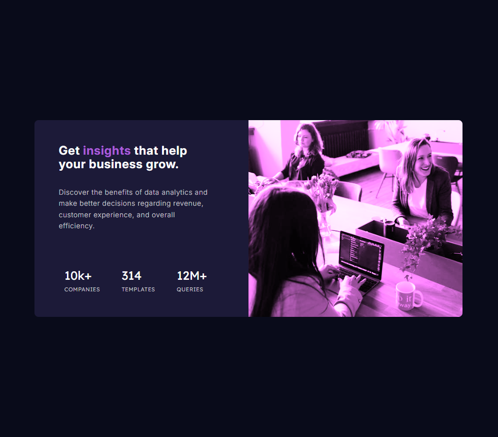

# Frontend Mentor - Stats preview card component solution

This is a solution to the [Stats preview card component challenge on Frontend Mentor](https://www.frontendmentor.io/challenges/stats-preview-card-component-8JqbgoU62). Frontend Mentor challenges help you improve your coding skills by building realistic projects.

## Table of contents

- [Frontend Mentor - Stats preview card component solution](#frontend-mentor---stats-preview-card-component-solution)
  - [Table of contents](#table-of-contents)
  - [Overview](#overview)
    - [The challenge](#the-challenge)
    - [Screenshot](#screenshot)
    - [Links](#links)
  - [My process](#my-process)
    - [Built with](#built-with)
    - [What I learned](#what-i-learned)
    - [Continued development](#continued-development)
    - [Useful resources](#useful-resources)
    - [AI Collaboration](#ai-collaboration)
  - [Author](#author)

## Overview

### The challenge

Users should be able to:

- View the optimal layout depending on their device's screen size

### Screenshot



### Links

- Solution URL: [Add solution URL here](https://github.com/josetarjosetar/fio-4-stats-preview-card-component)
- Live Site URL: [Add live site URL here](https://josetarjosetar.github.io/fio-4-stats-preview-card-component/)

## My process

### Built with

- Semantic HTML5 markup
- CSS custom properties
- Flexbox
- CSS Grid
- Mobile-first workflow

### What I learned

The biggest thing that I learned is how to create more responsive websites. The previous challenges that I built were mostly mobile websites and cards where there wasn't such a big of a challenge to create a desktop website.

One problem that I had was how to use the picture element with child elements source and img. I solved that problem by researching the picture element. It turns out that the picture element is a container to the img element. The img element is the element that the browser is going to render. The source element only serves as a source of a srcset for the img element.
In addition to solving the problem, I also learned how to style the img element inside of the picture element

```css
  .card-image img {
    ...
  }
```

Another problem that I had was how to create a mobile and desktop responsive website. I forgot to add the max-width attribute to the element that had the card-text class applied to it. Once I fixed that everything turned out great.

So basically, I learned something from solving the first two problems.

### Continued development

I want to continue developing the skill of creating responsive websites. I'm not yet comfortable with it.

### Useful resources

Nothing. I learned about the picture element by asking ChatGPT.

### AI Collaboration

```
Describe how you used AI tools (if any) during this project. This helps demonstrate your ability to work effectively with AI assistants.

- What tools did you use (e.g., ChatGPT, Claude, GitHub Copilot)?
- How did you use them (e.g., debugging, generating boilerplate, brainstorming solutions)?
- What worked well? What didn't?
```

I used ChatGPT to ask about the picture element and the containing child elements. ChatGPT gave me a good explanation of how the code that I wrote works. However, it gave too long of a response and I got a bit confused. I should work on prompting ChatGPT for explanations of the code.

## Author

- Frontend Mentor - [@josetarjosetar](https://www.frontendmentor.io/profile/josetarjosetar)
